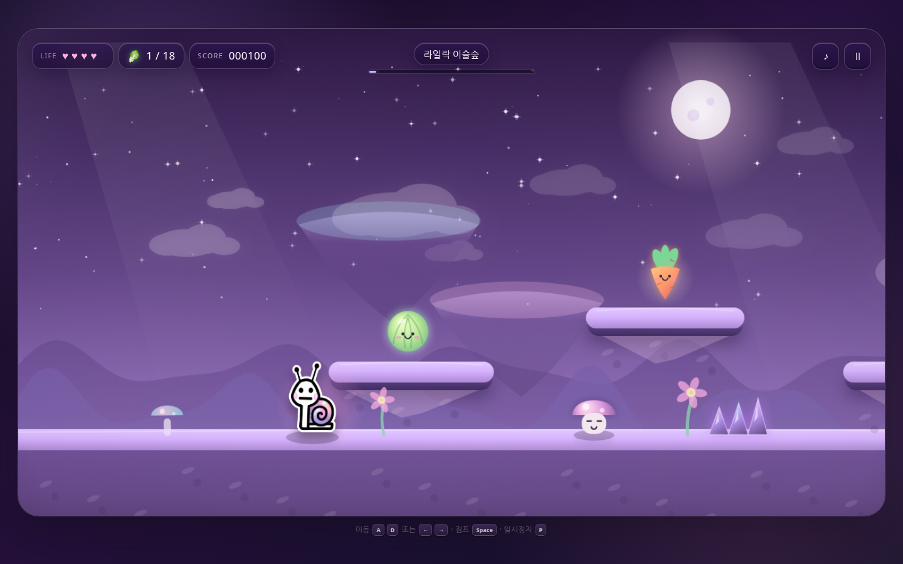

# 몽실이의 꿈채소 원정대

달팽이 **몽실이**가 몽환적인 채소 세계를 탐험하며 상추, 배추, 당근, 무를 모으는 반응형 횡스크롤 웹 플랫폼 게임입니다.



## 라이브 플레이

GitHub Pages 배포 후 아래 주소에서 실행됩니다.

**https://devcsb.github.io/mongsil-dream-veggie-game/**

## 조작

| 동작 | 키보드 | 모바일 |
| --- | --- | --- |
| 이동 | `A` / `D`, `←` / `→` | 화면 하단 이동 버튼 |
| 점프 | `Space`, `W`, `↑` | `JUMP` 버튼 |
| 일시정지 | `P`, `Esc` | 우측 상단 일시정지 버튼 |
| 다시 시작 | `R` | 결과 화면의 다시 시작 버튼 |

## 목표

꿈채소를 18개 이상 모은 뒤 맵 끝의 달빛 꿈문에 도착하세요. 수정 가시, 마법 웅덩이, 잠꾸러기 버섯을 피하면 더 높은 점수를 얻을 수 있습니다.

## 로컬 실행

별도 빌드 과정이나 외부 패키지가 필요하지 않습니다.

```bash
python3 -m http.server 8080
```

브라우저에서 `http://localhost:8080`을 열면 됩니다.

## 구성

- `index.html` — 게임 UI와 접근성 구조
- `styles.css` — 반응형 화면, 유리 질감 UI, 모바일 조작부
- `game.js` — 캔버스 렌더링, 물리, 충돌, 스테이지와 오디오
- `assets/` — 캐릭터, 아이콘, 미리보기 이미지
- `.github/workflows/pages.yml` — GitHub Pages 자동 배포

## 배포

GitHub CLI에 로그인된 환경에서는 아래 명령 하나로 `devcsb/mongsil-dream-veggie-game` 공개 저장소 생성, 최초 푸시, Pages 활성화를 진행할 수 있습니다.

```bash
./scripts/publish-to-github.sh
```

이후 `main` 브랜치에 푸시할 때마다 GitHub Actions가 정적 파일을 GitHub Pages에 자동 배포합니다.

## 저작권

게임 코드와 디자인은 이 프로젝트를 위해 제작되었습니다. `assets/snail.png`의 캐릭터 원본 권리는 저장소 소유자에게 있으며, 별도 허가 없이 재사용할 수 없습니다.
